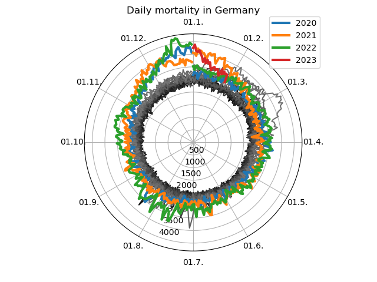

# Mortality in Germany

Plotting data to see if there is increased mortality during the COVID-19 pandemic:



Data source: https://www.destatis.de

## Run it yourself
Get data:
```
curl https://www.destatis.de/DE/Themen/Gesellschaft-Umwelt/Bevoelkerung/Sterbefaelle-Lebenserwartung/Tabellen/sonderauswertung-sterbefaelle-endgueltige-daten.xlsx?__blob=publicationFile -o sonderauswertung-sterbefaelle-endgueltige-daten.xlsx

curl https://www.destatis.de/DE/Themen/Gesellschaft-Umwelt/Bevoelkerung/Sterbefaelle-Lebenserwartung/Tabellen/sonderauswertung-sterbefaelle.xlsx?__blob=publicationFile -o sonderauswertung-sterbefaelle.xlsx

```
Create the plot
```
pip install -r requirements.txt
python plot.py
```